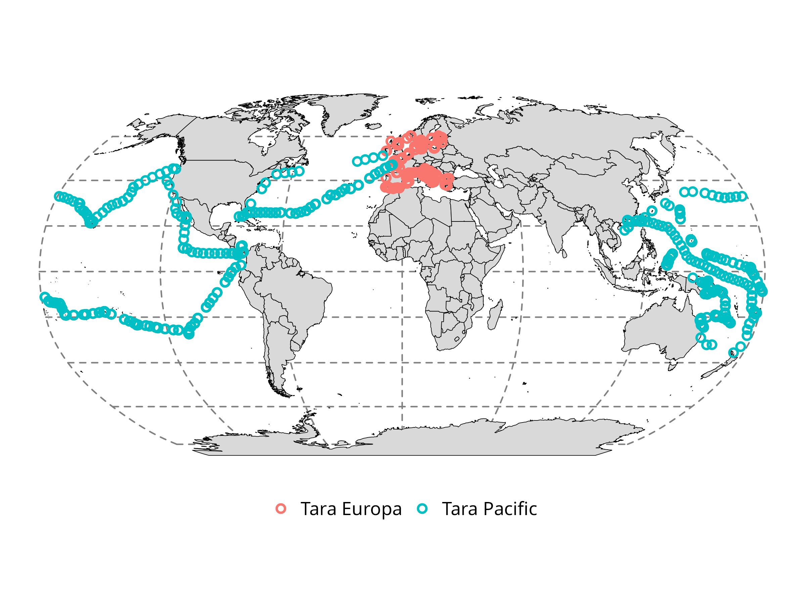
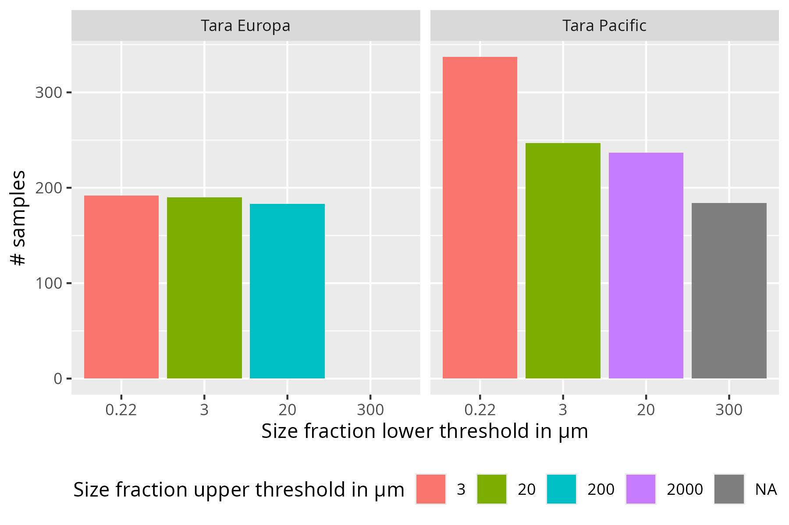
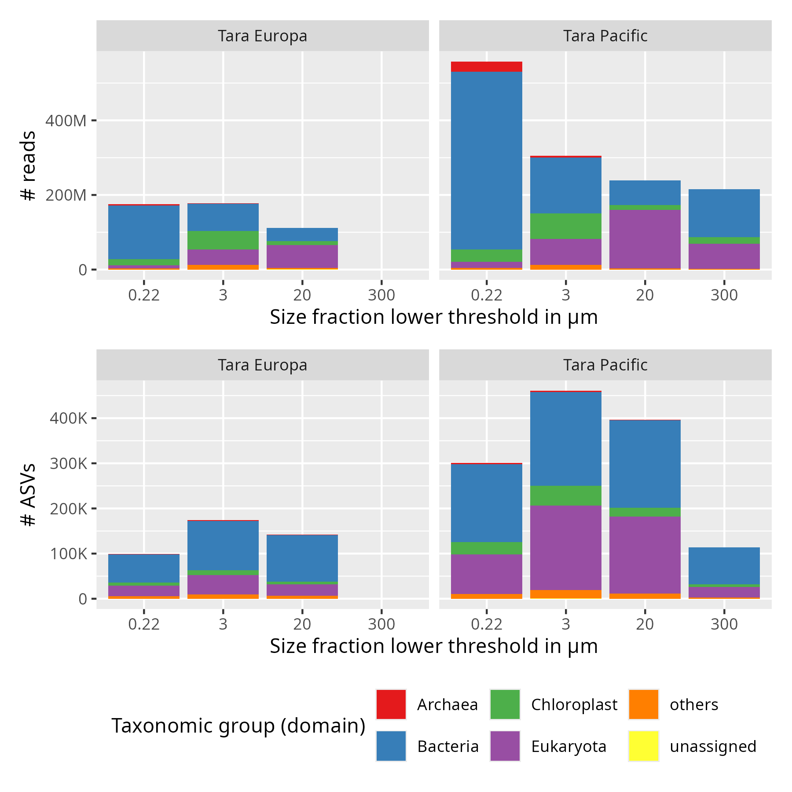

# PlanktoSpace *In Situ* Metabarcoding Dataset

## Introduction

This repository assembles a **metabarcoding dataset of sea surface samples** for the PlanktoSpace project, designed to match *in situ* biodiversity data with **hyperspectral satellite measurements**. The goal is to enable validation and calibration of satellite-derived biodiversity estimates, particularly for phytoplankton communities.

Metabarcoding is an environmental genomics approach that amplifies and sequences a marker gene from total DNA extracted from environmental samples (e.g., water, soil, sediment). Raw sequencing data are denoised into exact unique sequences called **Amplicon Sequence Variants (ASVs)**, which are assigned a taxonomy by comparison with reference sequence databases.

For this project, we selected metabarcoding samples generated with the **JEDI marker**[1](#jedi_paper), which allows for the recovery of all three domains of life (Archaea, Bacteria, and Eukaryota, including their chloroplasts) in a single PCR. This universality makes it particularly suitable for capturing the broad taxonomic diversity needed to align with satellite observations.

## Dataset Structure

The dataset is composed of three files.

- **ASVs** (`planktospace_metaB_v1_asvs.tsv.gz`): ASV descriptions, with 6 tab-separated fields:
    1. **asv_id**: ASV unique name / id.
    2. **total**: Total number of reads for this ASV across all samples.
    3. **spread**: Number of samples the ASV appears in.
    4. **taxonomy**: Consensus taxonomic assignment using `dada2::assignTaxonomy()` with both PR2 and SILVA databases.
    5. **confidence**: Consensus confidence scores from `dada2::assignTaxonomy()` using both PR2 and SILVA.
    6. **sequence**: Nucleic acid sequence.

- **Counts** (`planktospace_metaB_v1_counts.tsv.gz`): ASV counts (number of reads associated with each ASV in the samples), provided in long format, with 3 tab-separated fields:
    1. **asv_id**: ASV unique id (see `planktospace_metaB_v1_asvs.tsv.gz` for ASV descriptions).
    2. **sample**: Sample unique id.
    3. **nreads**: Number of reads for this ASV in this sample.

- **Samples** (`planktospace_metaB_v1_context.tsv.gz`): Sample descriptions, with 8 tab-separated fields:
    1. **sample**: Sample unique id.
    2. **size_fraction_lower_threshold**: Size fraction lower threshold (µm).
    3. **size_fraction_upper_threshold**: Size fraction upper threshold (µm).
    4. **datetime_utc**: Date and time in UTC (ISO 8601 format).
    5. **latitude**: Latitude in decimal degrees.
    6. **longitude**: Longitude in decimal degrees.
    7. **depth**: Depth interval in meters (e.g., `0-3` indicates between 0 and 3 meters).
    8. **expedition**: Expedition during which the sample was collected (Tara Pacific or Tara Europa).

## Input Data

## Re-used Datasets

### Description

The first version of the PlanktoSpace *in situ* metabarcoding dataset is assembled from data collected during the **Tara Pacific** and **Tara Europa** (part of TREC) expeditions. The datasets used are listed below:

| Expedition | Data type       | PID                                     | Status  |
| ---------- | --------------- | --------------------------------------- | ------- |
| Tara Pacific    | ASV table       | [10.5281/zenodo.19822864](https://doi.org/10.5281/zenodo.19822864) | Public  |
| Tara Pacific    | Sample metadata | [10.5281/zenodo.6299409](https://doi.org/10.5281/zenodo.6299409)  | Public  |
| Tara Europa (TREC)     | ASV table       | [10.5281/zenodo.21338057](https://doi.org/10.5281/zenodo.21338057) | Private |
| Tara Europa (TREC)     | Sample metadata | One per sample                          | Public  |
 
Both ASV tables were processed using the **same bioinformatic workflow**:

- Raw data were processed with the [`nf-core/ampliseq`](https://nf-co.re/ampliseq) pipeline (version **2.13.0**).
- Taxonomic assignment was performed using a custom Nextflow workflow with two reference databases (**PR2** for eukaryotes and **SILVA** for prokaryotes) and three classification methods (**RDP classifier** from DADA2, **IDTAXA**, and **VSEARCH --usearch\_global**).
- Outputs were standardized using a dedicated script.
- The workflow version and scripts are available [here](https://gitlab.com/tara-expeditions-euk-metab/metab-workflow-template/-/tree/parada-1.2.0).

### Samples Selection

Sea surface samples and their associated ASVs were extracted using:

- `01_tara_pacific_subset.R` for Tara Pacific samples.
- `02_tara_europa_subset.R` for Tara Europa samples.
- The two subsets were combined using `03_combine_datasets.R`.

# PlanktoSpace *In Situ* Metabarcoding Dataset Overview

The current version of the dataset includes **1,570 sea surface samples**:

- **Tara Europa**: Coastal samples across Europe (**n = 420**).
- **Tara Pacific**: A mix of coastal and open ocean samples, primarily from the Pacific Ocean, with additional samples from the North Atlantic Ocean (**n = 1150**).

Spatial distribution of the metabarcoding samples *Red: Tara Europa (coastal). Blue: Tara Pacific (open ocean/coastal).*

During Tara expeditions, water samples are typically filtered through multiple filters/sieves to create complementary size fractions, recovering organisms from pico- to mesoplankton. Size fractions are comparable between expeditions, **except for the \> 300 µm fraction in Tara Pacific**, which is not present in Tara Europa.

Number of samples per size fraction. *Each bar represents the lower threshold of the size fraction, filled by the upper threshold. "NA" indicates no pre-filtration was applied.*

The JEDI marker recovers **Archaea, Bacteria, and Eukaryota**, including chloroplasts. Photosynthetic eukaryotes carry chloroplasts, which contain genomes closely related to cyanobacteria. As a result, the JEDI marker is detected twice for phytoplankton: once in the nucleus (domain Eukaryota) and once in the chloroplast (domain Chloroplast).

Total number of reads and ASVs per size fraction *Contribution of each taxonomic category is indicated by color. **Note**: Chloroplast reads are retained to capture photosynthetic diversity but may require separate analysis for ecological interpretations. Eukaryotes may be underrepresented in smaller size fractions due to filtration limits.*

## How to Cite

If you use this dataset, please cite:

- The **PlanktoSpace project** (funded by ESA).
- The **original Tara expeditions datasets**:
  - Tara Pacific: [10.5281/zenodo.19822864](https://doi.org/10.5281/zenodo.19822864)
  - Tara Europa: [10.5281/zenodo.21338057](https://doi.org/10.5281/zenodo.21338057)

## License

This dataset is licensed under **Creative Commons Attribution 4.0 International (CC-BY 4.0)**.

**Note**: Tara Europa ASV tables are currently **private** and will be made public upon completion of the TREC project embargo period (expected: 2028).

## Version History

| Version | Date       | Changes                                                      |
| ------- | ---------- | ------------------------------------------------------------ |
| 1.0     | 2026-08-24 | Initial release: Tara Pacific + Tara Europa (TREC) data.     |
| 2.0     | Planned    | Addition of Mission Bougainville data (expected: early 2027). |

## Aknowledgements

This work was funded by :

    <table>
        <tr>
            <td valign="middle"></td>
            <td valign="middle"></td>
        </tr>
    </table>

## References

<a name="jedi_paper">1</a>: Priest, T., Henry, N., Weber, T., Planat, L., Rousseau, C., Dittami, S. M., ... & de Vargas, C. (2025). The JEDI marker as a universal measure of planetary biodiversity. bioRxiv, 2025-08. https://doi.org/10.1101/2025.08.11.669668